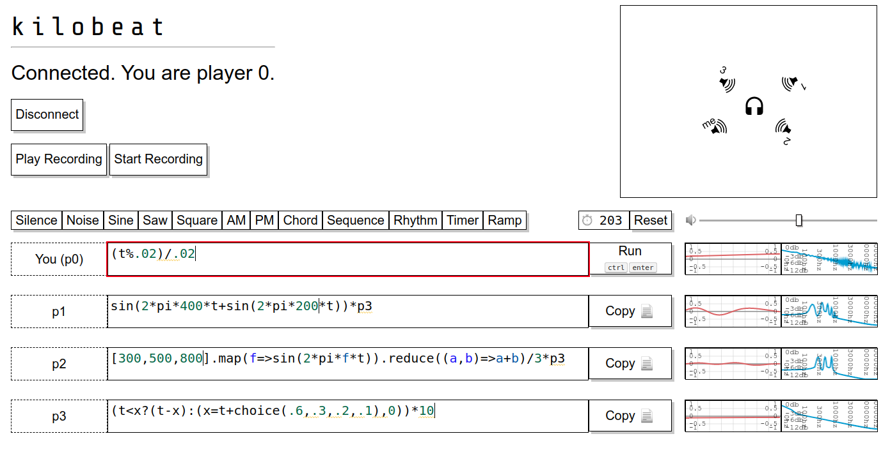

# kilobeat

Networked livecoding instrument, with aleatoric recording and playback.

### [Demo](https://ijc8.me/kilobeat)

## Usage

### Online mode
In online mode, each player has control over a single Javascript expression, which generates successive samples of that player's audio output. This is their instrument. Each player has one instrument, and players can see what all other players are doing as they edit and run their code. Players can also control _where_ they play their instrument using the canvas at the top: the headphones represent the listener, and each player can move their speaker by dragging (to change position) and scrolling (to change angle).

Several example snippets (presets) are included for demonstration and convenience.

For a few quick examples, the expression `0` generates silence. `sin(2*pi*440*t)` generates a pure tone at 440 Hz. `(rand() * 2) - 1` generates white noise.

All the [Javascript math functions](https://developer.mozilla.org/en-US/docs/Web/JavaScript/Reference/Global_Objects/Math) are available for use in expressions without the `Math.` prefix. A couple of aliases are available for convenience: `rand = Math.random`, `pi = Math.PI`, and `e = Math.E`.

Expressions can reference 5 special variables.
`t` refers to the clock time in seconds, as of the current sample.
`now` refers to the time at which the current expression started running.
`x`, `y`, and `z` are variables free for the player's use; they're initialized to 0, by players may change them as they wish (since JS allows assignments in expressions).

Players can reference other players' streams by name. For instance, if player 0's expression is `t%2<1` and player 1's expression is `sin(2*pi*440*t)*p0`, `p0` will take the values of player 0's output, and player 1's output will be a tone that alternates between playing for a second, and resting for a second.

Currently, other players' values are delayed by 128 samples, but this is likely to change in future versions.

The output of all expressions is clipped to the range `[-1, 1]`, so the expression `5` is equivalent to `1`, and the expression `sin(2*pi*t*440)*N` will converge to a square wave as `N` approaches infinity.

You can run a server with `./run.sh`; this requires some Python 3 dependencies, as listed in `requirements.txt`. Watch this space for a public server.

### Security notice
In online mode, other players can run arbitrary Javascript in your browser. As far as I am aware this is relatively low-risk, as Javascript runs in a sandbox, the application does not request any permissions beyond playing audio, and the arbitrary Javascript is trapped inside an AudioWorklet (and thus can't call `alert()`, create cross-site requests, or access the main thread's memory).

## Offline mode
Offline mode is just like online mode, except that you can play all the instruments yourself, so to speak. That is, you can create additional offline 'players' and control their expressions and speakers, too, in addition to the one you control in online mode.

## Recording and Playback
You can record a performance and play it back later using the buttons on the right. The recording will include all the visible details of the performance: cursor motion, edits, code execution, and speaker motion. On playback, these events are replayed and the sound is generated again. Unlike an audio recording, the audio may well be different on playback, particularly if the player's used randomness - this will be freshly generated on playback.

For demonstration, a recording (`recording.kb`) is included in this repository.

## Built with

- [CodeMirror](codemirror.net)
- [JSHint](http://jshint.com/)
- [Flask](https://flask.palletsprojects.com/)
- [Flask-SocketIO](https://flask-socketio.readthedocs.io/)

## Inspired by

- [bytebeat](http://canonical.org/~kragen/bytebeat/)
- [Audio DSP Playground](https://github.com/acarabott/audio-dsp-playground)
- [Gibber](https://gibber.cc/) and other web-based livecoding environments

## Credits

Ian Clester [ijc8.me](https://ijc8.me)

Initial CSS styles and WebAudio code blatantly stolen from Arthur Cabott's [Audio DSP Playground](https://github.com/acarabott/audio-dsp-playground), which in turn adapted stabilized oscilloscope code from <a href="https://codepen.io/ContemporaryInsanity/pen/Mwvqpb">Ewen</a>.

Spatialization adapted from Boris Smus' [WebAudio demos](https://github.com/borismus/webaudioapi.com).